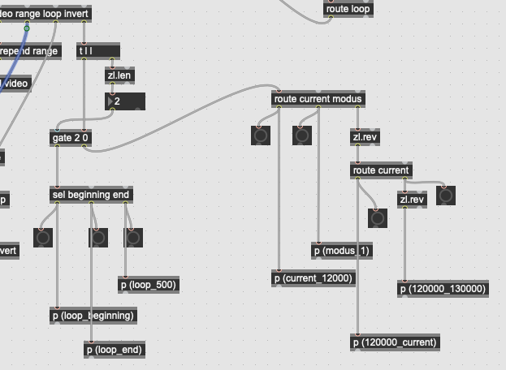

# Tesser_video

This devide does video and image operations, has parameters accessible via midi, and paths and other configurations via clip names.

---

> ## [INSTRUCTIONS (PUBLIC)](public/README.md)

---

## Loading slides

Use the clip name. There are 2 slots for slides, each with a transparency slider that can be controlled via midi as well. 

```
slide1 {name} {"path/to/image.png}
```

The following example loads an image to the slot 1:

> `slide1 NAME "Macintosh HD:/Users/artacho/Desktop/Herschel Project/slides/Herschel - TITLE.png"`

The next one will load an image onto the second slot:

> `slide2 NAME "Macintosh HD:/Users/artacho/Desktop/Herschel Project/slides/planeten11.png"`

The transparency can be controlled using CC. The specific CC numbers can be stored with the set (see `storage` button), but default ones are `CC88` for *slide1* and `CC89` for *slide2*.

---

### Issue with CC90

| ---             | 0 (video) | 1 (slide1) | 2 (slide2) |
| --------------- |:---------:|:----------:|:----------:|
| `A` **0 0**     | OK        | OK         | OK         |
| `B`  **0 127**  | oook      | OK...      | OK         |
| `C` **127 0**   | oook      | OK         | OK...      |
| `D` **127 127** |           | OK         | OK         |

~~~~

This is

> debug1: 1 A
> debug2: 1A
> debug3: 1 0
> debug1: 1 A
> debug2: 1A
> debug3: 1 0
> debug0: 0 0
> debug0: 1 0
> debug0: 2 0
> debug0: 3 0
> ...
> debug0: 126 0

---

## Load Video

Also with a clip name:

```
video {name} {command} {frame number} {"path/to/image.png}
```

> `video {name} {command} {frame number} {"absolute/path/to/video"}`

The `commands` + `frameNum` can be:

> `start 10` Starts to play in the given frame
> 
> `stop 200` goes to a given frame and stops playing
> 
> `frame 500` moves the playhead to a given frame

Examples:

`video mem1 start 3000 \"EXTERN:/SIXMEMOS - 2023/1 Leggerezza/Memos _ Leggerezza.mp4\"`

`video mem0 stop 6000 \"EXTERN:/SIXMEMOS - 2023/Herschel Project/slides/Herschel_Experiment.mov\"`

`slide1 VISIBILITA "EXTERN:/SIXMEMOS - 2023/6MfPaSPP - Live Project/slides/4_visibilita.png"`

`slide2 COERENZA "EXTERN:/SIXMEMOS - 2023/6MfPaSPP - Live Project/slides/6_Coerenza.png"`

---

### Frame commands

#### Play section of the video (frame)

You may play a section of a loaded video (say 5 seconds starting on frame 2980) by entering the following clip name:

> ```
> frame {starting frame} {milliseconds}
> ```
> 
> `e.g. frame 2980 5000`

#### Play/Stop from a given frame (no end boundary)

> ```
> frame {starting frame} {command}
> ```
> 
> `frame 2000 start`
> 
> `frame 2000 stop`
> 
> `frame 2000` (it will go on playing if it was already)

---

### Looping

`loop 500` loop from the current frame 500 ms

`loop beginning` set the current frame as the beginning of the loop

`loop end` set the current loop as the loop end

`loop 4000 5000` loop between frames 4000 and 5000

`loop current 5000` loop between current frame and 5000

`loop 4000 current` loop between frame 4000 and current one

`loop mode 1` set the loop mode

---

### Inverting

`invert x` invert x axis to whatever state it is now

`invert x 0` deactivates inverting x axis

`invert x 1` activates inverting x axis

`invert y` inverts the y axis, in regards to whichever state it is in now

`invert y 0` deactivates y axis inversion

`invert y 1` activates y-axis inversion

---

### Using a remote .csv file to code commands

Using the [download-sheet](https://bitbucket.org/AdrianArtacho/download-sheet) object, I can codify specific commands and trigger them as midinotes.

**COMMAND ID**

>  The first word (e.g. `RAP4`) in the string is a human-readable 'name' for reference

**COMMANDS**

> `slide1`
> 
> Loads a specific file onto the first slider. E.g.:
> 
> ```
> RAP1 slide1 "EXTERN:/Max PROJECTS/tesserakt/tesser_video/test_media/Slides_test1.png"
> ```
> 
> ---
> 
> `slide2`
> 
> Same, but for the second slider.
> 
> ---
> 
> `video`
> 
> It loads the video. It needs to be entered in combination with frame/start/stop.
> 
> ```
> <ID> video <frame/start/stop> <position> <filepath>
> ```
> 
> ---
> 
> `frame`
> 
> 
> 
> ...
> 
> ---
> 
> `range`
> 
> Sets the range that the 'scrub' will be restricted to. E.g.:
> 
> ```
> <ID> range 513 581
> ```
> 
> ---
> 
> `loop`
> 
> The loop also requires two values, but these are the frames???. E.g.:
> 
> ```
> <ID> loop 16935 19195
> ```
> 
> 
> 
> ---
> 
> `invert`
> 
> Inverts the video image by the *x* or the *y* axes. This needs to be turned on/of numerically. E.g.:
> 
> ```
> <ID> invert x 1
> <ID> invert x 0
> ```
> 
>  ---
> 
> `var`
> 
> Sets the gap for the 'drunk' mode. E.g.:
> 
> ```
> <ID> var drunkgap 200
> ```
> 
> ...

The messages can be put together with the help of commas:

```
16935 19195, frame 512 start, range 513 581
```

---

### CC input

| CC number | param            |                                                                                                                                                                                          |
| --------- | ---------------- | ---------------------------------------------------------------------------------------------------------------------------------------------------------------------------------------- |
| `88`      | `slide1`         | Control the opacity of the slide #1                                                                                                                                                      |
| `89`      | `slide2`         | Control the opacity of the slide #2                                                                                                                                                      |
| `90`      | "smart fade"     | Controls the opacity of slides 1 & 2, depending on the current state, and what we want to fade in (video, slide1, or slide2)                                                             |
| `91`      | loop mode        | ?                                                                                                                                                                                        |
| `92`      | "scrubbing dial" | Use to "scrub" with a given range (this is set using the command `range <frame start> <frame end>`)                                                                                      |
| `93`      | rate dial        | This controls the dial (0 <> 127) which itself controls the playback rate. Default (64) equals a 1.x rate. The min. and max. values are a logarithmic function of the `max. rate` value. |
| `94`      | max. rate        | This controls the maximum playback rate that can be set through the `rate dial` value. For values < 64 in the `rate dial`, the reduces logarithmically according to the same value.      |

---

## Log~

###### 2023-11-08

> Fix `jit.window` name to something neutral
> 
> sliders to zero on [thispatcher]
> 
> Load video via Clip name using simply "video"
> 
> Play without end boundary...
> 
> do not necessarily play a few frames when loaded!
> 
> load AND play/stop in one clip
> 
> video {name} start 2000 {"path/to/file"} does not go to the frame
> 
> Smooth sound edges when using *frame*? 
> 
> video {name} stop {frame} does not stop
> 
> the command `frame {start frame}` does stop at some point when I do not provide a second {end frame} value
> 
> stop video play when the set stops?
> 
> video repeat mode in a CC?
> 
> show slider values for debugging
> 
> remove ezdc

master fade `CC90` that fades in/out smartly.

> - switching between slide1 and slide2
> 
> - nach 1D stehen sliders nicht auf 0

---

## To-Do

- Prettyfy interface

- It would be ideal to accept relative paths, so the sets can be moved to a different computer wityhout too much hassle.

- add the length of the frame instead of milliseconds, relative to the set tempo (bar, beat, etc.) which then get converted to milliseconds

- Why does it play a second upon starting a set?

- rename `herschel_jit_movie` message to something neutral

- remove inherited `[frame_delay]` instances from herschel

- what is the issue with `tesser_videoloop`?

- ISSUE WITH SMART SLIDES!!

###### 2024-03-09

> Issue with the timing: the seconds don't seem right
> 
> > [jit.movie] duration spits out 196689 for a video that is 328 seconds long.
> > 
> > --> I should use _milliseconds_ instead.
> 
> Do slides with transparent background work?
> 
> > yes! (Slide 1 stays over slide 2)

###### 2024-03-10

> I did some OSC tests, and everything seems fine :)
> 
> There are some minor issues to fix, namely:
> 
> - useless [print] objects: *jitextra*, *sdvsdv*, *averaver*, *debug1*, *debug2*, *debug3*
> 
> - Re-program keyboard shortcuts:
> 
> > shortcuts ON: -9
> > 
> > shortcuts OFF: -10
> > 
> > previous cue: -11
> > 
> > repeat current cue: -12
> > 
> > back to beginning: -5
> 
> - Video commands and frames... i don't understant it yet
> 
> - ONLY FILES WITH NO SPACES (eventually I should fix it so that this is never a problem)
> 
> - Text loading different images (it should be fine though) and document the right command for that in the *sheet*.
> 
> ...

---

### ToDo

- Dimensions of the image? Probably not, unless it is enforced by my patch!
- Rotate image?
- Manipulate video image: colors, water-fx distortion, bw, caleidoscope... etc.